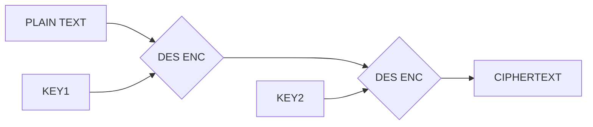
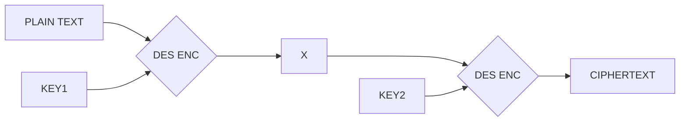
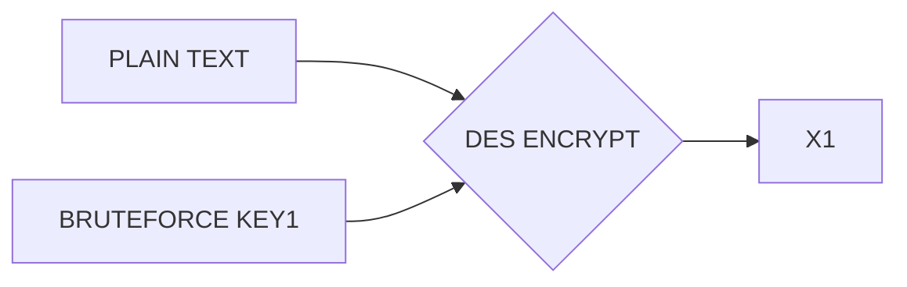
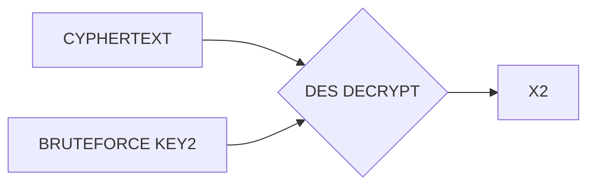

# Writup de Double DES - PicoCTF

### Description initiale :

I wanted an encryption service that's more secure than regular DES, but not as slow as 3DES... The flag is not in standard format. `nc mercury.picoctf.net 5958`  [ddes.py](https://mercury.picoctf.net/static/c4dfb8340dd2d5808d92f34a5683c04d/ddes.py)

### Programme python :
```python
#!/usr/bin/python3 -u
from Crypto.Cipher import DES
import binascii
import itertools
import random
import string


def pad(msg):
    block_len = 8
    over = len(msg) % block_len
    pad = block_len - over
    return (msg + " " * pad).encode()

def generate_key():
    return pad("".join(random.choice(string.digits) for _ in range(6)))


FLAG = open("flag").read().rstrip()
KEY1 = generate_key()
KEY2 = generate_key()


def get_input():
    try:
        res = binascii.unhexlify(input("What data would you like to encrypt? ").rstrip()).decode()
    except:
        res = None
    return res

def double_encrypt(m):
    msg = pad(m)

    cipher1 = DES.new(KEY1, DES.MODE_ECB)
    enc_msg = cipher1.encrypt(msg)
    cipher2 = DES.new(KEY2, DES.MODE_ECB)
    return binascii.hexlify(cipher2.encrypt(enc_msg)).decode()


print("Here is the flag:")
print(double_encrypt(FLAG))

while True:
    inputs = get_input()
    if inputs:
        print(double_encrypt(inputs))
    else:
        print("Invalid input.")
```

### Analyse du programme :
Essayons de comprendre le fonctionnement du programme :
le flag en clair est situé dans le fichier `flag` et mis dans la variable `FLAG`.
le programme génère 2 clés `KEY1`et `KEY2` de longueur 8 bits. Information importante les clés sont de la forme `b'xxxxxx  '` avec x un chiffre entre 0 et 9. La range est donc de `b'000000  '` à `b'999999  '` en suite le flag est encrypté deux fois en DES.

#### schéma résumé


### Connexion au serveur 

maintenant qu'on a compris en gros ce que faisais le programme il faut voir quelles information on a sur le serveur `mercury.picoctf.net` et quelles actions on peut faire.
j'utilise `pwntools` pour me connecter au serveur :
```py
>>> import pwn
>>> serv = pwn.remote("mercury.picoctf.net",5958)
[x] Opening connection to mercury.picoctf.net on port 5958
[x] Opening connection to mercury.picoctf.net on port 5958: Trying 18.189.209.142
[+] Opening connection to mercury.picoctf.net on port 5958: Done
>>> serv.readrepeat(timeout=2).decode()
'Here is the flag:\nf8367906c788606920dfa34480b1eaa9b9136bede7d090e948dfb63c855593b1b473bcd5ea2e71ef\nWhat data would you like to encrypt? '
>>> serv.sendline("test".encode('ascii').hex().encode())
>>> serv.readrepeat(timeout=2).decode()
'ac33404824c1efda\nWhat data would you like to encrypt? '
```

on peut constater que le serveur nous envoie le ciphertext de `FLAG` convertit en hexa et qu'on peut envoyer une valeur au serveur pour qu'il nous le chiffre en double DES **avec le même double de clé (KEY1,KEY2)** que le `FLAG`. 

C'est là qu'on va attaquer. C'est une enorme faille de pouvoir encrypter un texte avec le même double de clé que le `FLAG`. Pourquoi ? Car en connaissant le ciphertext d'un plaintext connu lui aussi on peut facilement retrouver la paire de clé utilisé. C'est ce qu'on va faire.

### Principe d'attaque

le principe d'attaque ce repose sur du bruteforce, mais faut le faire intelligemment pour pas avoir un programme qui met 1h à se terminer. Pour ça on va procéder à deux brute force simultané sur `KEY1` et `KEY2` au lieu de bruteforce la combinaison des deux. dans ce challenge les clés sont généré d'une manière particulière entraine un nombre de possibilité de clés différentes de 1 000 000 ce qui est peu, mais dans un cas réel la technique que je vais utiliser est fiable car les clés sont de longeur 56 bit, donc tester de bruteforce la combinaison des deux s'élève à 2^112^ possibilité, ce qui est... trop. La technique utilisé reduit le bruteforce à 2^56^ dans un cas réel. Ici on passe juste de 1 000 000 000 000 à 1 000 000.

---
le but est de trouver une paire de clé qui va donner le même `X`.


---
D'un côté je vais chiffrer le message `plain text` avec toutes les clés possible (1 000 000 possibilité) en remplissant un tableau de `X` potentiel (je vais appeler ce tableau `X1`) ainsi qu'un tableau avec les clés (je vais appeler ce tableau `K1`). Cela me permet de retrouver pour chaque x la clé associé (flemme de faire un dictionnaire j'ai fait deux tableau).


---
D'un autre côté je vais déchiffrer le `cyphertext` avec toutes les clés possible (1 000 000 possibilité) en remplissant un tableau de `X` potentiel (je vais appeler ce tableau `X2`) ainsi qu'un tableau avec les clés (je vais appeler ce tableau `K2`). Cela me permet de retrouver pour chaque x la clé associé (pareil, flemme de faire un dictionnaire j'ai fait deux tableau).


---

En suite je comparerais facilement les tableau `X1` et `X2` pour en faire l'intersection et trouver quelles valeurs de `X` sont dans les deux tableau. Grâce à ça je récupererais en suite la paire de clé et enfin je l'utiliserais pour décrypter le ciphertext du flag.

### Mise en pratique

```python
from Crypto.Cipher import DES
import binascii

def pad(msg):
    block_len = 8
    over = len(msg) % block_len
    pad = block_len - over
    return (msg + " " * pad).encode()


def generate_key_val(value):
    value = "0"*(6-len(value))+value
    return pad(value)

def hex_to_bytes(hexa):
    if hexa[0:2] == "0x":
        hexa = hexa[2:]
    decypher = binascii.unhexlify(hexa)
    return decypher

def decrypt_DDES(k1,k2,cypher_hex):
    cipher1 = DES.new(k1, DES.MODE_ECB)
    cipher2 = DES.new(k2, DES.MODE_ECB)
    ct = hex_to_bytes(cypher_hex)
    x = cipher2.decrypt(ct)
    clair = cipher1.decrypt(x) 
    try:
        print("potential_flag : ",clair.decode())
    except:
        print("can't decode flag, keep it in bytes format :")
        print("potential_flag :",clair)

def DDES_cracking(known_plaintext,known_ciphertext,flag_ciphertext):
    plain_text = known_plaintext
    cypher_hex = known_ciphertext
    flag_hex = flag_ciphertext

    print(f"Trying to find k1 and k2 who generate [{cypher_hex}] with plaintext [{plain_text}]")

    K1 = []
    X1 = []
    K2 = []
    X2 = []

    msg = pad(plain_text)

    print("Start creating all X1 values")
    for i in range(999999):
        if Fraction(int(i),int(1000)).denominator == 1:
            print(f"{round(i/9999,1)}%\r",end="")
        key = generate_key_val(str(i))
        cipher = DES.new(key, DES.MODE_ECB)
        X1.append((cipher.encrypt(msg)).hex())
        K1.append(key)

    print("Start creating all X2 values")
    ct = hex_to_bytes(cypher_hex)
    for i in range(999999):
        if Fraction(int(i),int(1000)).denominator == 1:
            print(f"{round(i/9999,1)}%\r",end="")
        key = generate_key_val(str(i))
        cipher = DES.new(key, DES.MODE_ECB)
        X2.append((cipher.decrypt(ct)).hex())
        K2.append(key)

    print("Start finding correlation beetween X1 and X2 values\r",end="")
    for result in list(set(X1).intersection(X2)):
        possible_k1 = K1[X1.index(result)]
        possible_k2 = K2[X2.index(result)]
        print(f"find potential k1={possible_k1} and potential k2={possible_k2}")

    print(f"Trying to decipher the flag [{flag_hex}] with the key we just find :")
    decrypt_DDES(possible_k1,possible_k2,flag_hex)
```

la fonction `DDES_cracking` fait exactement ce que j'ai expliqué plus haut, il faut lui envoyer 3 arguments :

- un plaintext dont vous connaisser le ciphertext
- le ciphertext du plaintext
- le ciphertext du flag que vous voulez décrypter

ici le serveur m'avais envoyé la valeur du  flag : `f8367906c788606920dfa34480b1eaa9b9136bede7d090e948dfb63c855593b1b473bcd5ea2e71ef`
et j'avais envoyer la valeur `test` convertit en hexa ce qui m'avais donné `ac33404824c1efda`

#### Execution du programme

```py
>>> DDES_cracking("test","ac33404824c1efda","f8367906c788606920dfa34480b1eaa9b9136bede7d090e948dfb63c855593b1b473bcd5ea2e71ef")
Trying to find k1 and k2 who generate [ac33404824c1efda] with plaintext [test]
Start creating all X1 values
Start creating all X2 values
find potential k1=b'662040  ' and potential k2=b'624606  '
Trying to decipher the flag [f8367906c788606920dfa34480b1eaa9b9136bede7d090e948dfb63c855593b1b473bcd5ea2e71ef] with the key we just find :
potential_flag :  e21cf83f64e53a743e685e55852feaf2        
>>> 
```

---

Flag : e21cf83f64e53a743e685e55852feaf2

Auteur : SoMadd#8216
